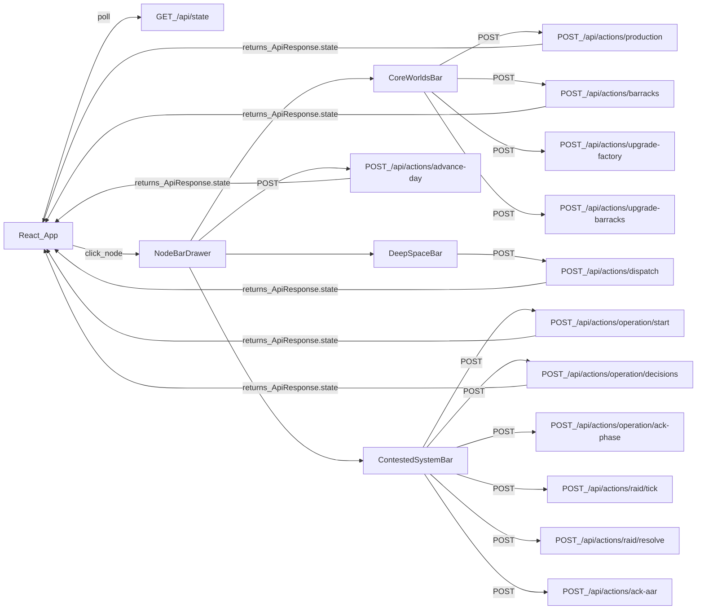

# Three integrated node bars (Core/Deep/Contested)

## Goals (explicit)

- **One shared bottom drawer** that opens when clicking any of the three strategic nodes: `new_system_core`, `deep_space`, `contested_front`.
- Drawer **swaps content** (Core vs Deep vs Contested) with deterministic animations; it never renders placeholder text.
- All three bars are **fully powered by `GameStateResponse**` from `GET /api/state` and **fully wired actions** via `POST /api/actions/*` endpoints in `[sim-v2/server/api/router.py](sim-v2/server/api/router.py)`.
- Core Worlds bar gets a **tightened redesign**: clearer hierarchy, consistent chips, less repetition, actions actually call backend.

## Current state (what exists today)

- Map renders 3 labeled nodes from v2 state in `[sim-v2/client/src/data/mapFromGameState.ts](sim-v2/client/src/data/mapFromGameState.ts)`.
- Node click only opens drawer for Core Worlds:

```35:45:sim-v2/client/src/App.tsx
  const handleNodeClick = (nodeId: string) => {
    if (nodeId === 'new_system_core') {
      setSelectedNodeId(nodeId);
      setIsDrawerOpen(true);
    }
  };
```

- Drawer hard-limits to Core Worlds:

```13:26:sim-v2/client/src/components/SystemDrawer.tsx
export function SystemDrawer({ isOpen, onClose, selectedNodeId, state, onQueueJob }: SystemDrawerProps) {
  // Only Core Worlds opens the drawer for now
  const isCore = selectedNodeId === 'new_system_core';
  // ...
  if (!isCore) return null;
```

- Backend already supports full control surface for production/barracks/logistics/ops/raid/day in `[sim-v2/server/api/router.py](sim-v2/server/api/router.py)`.

## Architecture decisions (locked)

- **Drawer component model**: one shared “shell” component (positioning/close behavior/animations) plus three “content panels” (Core, Deep, Contested) swapped based on `selectedNodeId`.
- **State model**: `useGameState()` remains the source of truth; after any action call, we immediately apply returned `payload.state` (authoritative) and also keep polling.
- **Action feedback**: all action responses show toasts using backend `message` and `messageKind` from `ApiResponse`.

## Data contract mapping (exact)

### Node IDs and meaning

- **Core Worlds** node ID: `new_system_core`
- **Deep Space** node ID: `deep_space`
- **Contested System** node ID: `contested_front` (map label “CONTESTED SYSTEM” already)

### GameStateResponse fields used by each bar

- **Shared (all bars)**
  - `state.day`
  - `state.actionPoints`
  - `state.logistics.routes` (for route health chips)
  - `state.logistics.activeOrders` (for “in motion” counters)
  - `state.logistics.shipments` and `state.logistics.ships` (for transit counters)
  - `state.lastAar` (global AAR banner + deep link inside contested bar)
- **Core Worlds bar (core depot + production)**
  - Depot: `state.logistics.depots.find(d => d.id === 'new_system_core')`
    - `supplies.ammo`, `supplies.fuel`, `supplies.medSpares`
    - `units.infantry`, `units.walkers`, `units.support`
  - Production pool: `state.production.{factories,maxFactories,slotsPerFactory,capacity,costs,jobs}`
  - Barracks pool: `state.barracks.{barracks,maxBarracks,slotsPerBarracks,capacity,costs,jobs}`
- **Deep Space bar (logistics/transit control)**
  - Routes: `state.logistics.routes[]` (each has `origin`,`destination`,`travelDays`,`interdictionRisk`)
  - Depots list: `state.logistics.depots[]` (for selectable dispatch origins)
  - Shipments: `state.logistics.shipments[]`
  - Ships: `state.logistics.ships[]`
  - Active orders: `state.logistics.activeOrders[]`
  - Transit log: `state.logistics.transitLog[]` (most recent N entries)
- **Contested System bar (planet + task force + ops/raid)**
  - Planet: `state.contestedPlanet.{control,objectives[],enemy{infantry,walkers,support,fortification,reinforcementRate,cohesion,intelConfidence}}`
  - Task force: `state.taskForce.{composition,readiness,cohesion,location,supplies}`
  - Operation: `state.operation` (entire object)
  - Raid: `state.raid` (entire object)
  - AAR: `state.lastAar` (operation or raid)

## UI/UX design spec (no ambiguity)

### Shared drawer shell (applies to all three)

- **Placement**: fixed `bottom: 0; left: 0; right: 0; z-index: 40` (matches current).
- **Max height**: `maxHeight: 52vh` desktop, `60vh` mobile; internal content scroll.
- **Backdrop**: no full-screen overlay (keeps map visible); drawer uses `bg-space/90` + `backdrop-blur-md`.
- **Close mechanisms**:
  - Click X button
  - Press `Escape`
  - Clicking selected node again toggles closed (explicit change from current behavior)
- **Header layout** (single row):
  - Left: colored dot (pulsing) + title + subtitle
  - Center: compact “chips” row (route health, AP, day)
  - Right: actions cluster: Refresh, Advance Day, Close

### Shared visual language

- **Core palette**: cyan (`core`)
- **Deep palette**: amber (`deep`)
- **Contested palette**: red (`contested`)
- **Typography**:
  - Titles: `font-mono`, tracking `0.18em`, uppercase
  - Values: `font-mono` bold
  - Labels: `text-[10px]` uppercase, `text-text-secondary`

### Animations (exact values)

#### Drawer open/close (shell)

- Uses Framer Motion on the outer container.
- **Open**: from `y: '100%'` to `y: 0`.
- **Close**: to `y: '100%'`.
- Transition: `type: 'spring', damping: 26, stiffness: 220, mass: 0.9`.

#### Drawer content swap (Core ↔ Deep ↔ Contested)

- Keep the shell mounted; swap the inner panel keyed by `selectedNodeId`.
- Use `AnimatePresence mode="wait"`.
- **Exit**: `opacity: 0`, `y: 12`, duration `0.16`, ease `easeIn`.
- **Enter**: `opacity: 1`, `y: 0`, duration `0.22`, ease `easeOut`.

#### Live value updates

- Any numeric “bar fill” animates with `motion.div` width changes.
- Width transition: `duration: 0.45`, ease `easeOut`.
- Any “severity chip” (active/disrupted/blocked) cross-fades `duration: 0.18`.

#### Map-node to drawer continuity (micro)

- When a node is selected, the corresponding node in `[sim-v2/client/src/components/MapNode.tsx](sim-v2/client/src/components/MapNode.tsx)` already scales/pulses. Keep it.
- Add a subtle “selection pulse” on click:
  - one-time ring: `opacity: [0.7, 0]`, `r: [glowRadius, glowRadius + 55]`, `duration: 0.65`, ease `easeOut`.

## Component breakdown (exact files and responsibilities)

### 1) Replace `SystemDrawer` with a shared node-bar drawer

- Create `[sim-v2/client/src/components/nodeBars/NodeBarDrawer.tsx](sim-v2/client/src/components/nodeBars/NodeBarDrawer.tsx)` containing:
  - Props: `{ isOpen, selectedNodeId, state, onClose, onActionResult }`
  - Header rendering (title/subtitle/chips/actions)
  - Content swap region for panel components
  - ESC handler
  - “click selected node again toggles close” handled in `App.tsx` (see below)
- Create panels:
  - `[sim-v2/client/src/components/nodeBars/CoreWorldsBar.tsx](sim-v2/client/src/components/nodeBars/CoreWorldsBar.tsx)`
  - `[sim-v2/client/src/components/nodeBars/DeepSpaceBar.tsx](sim-v2/client/src/components/nodeBars/DeepSpaceBar.tsx)`
  - `[sim-v2/client/src/components/nodeBars/ContestedSystemBar.tsx](sim-v2/client/src/components/nodeBars/ContestedSystemBar.tsx)`
- Create shared UI primitives (to avoid repetition and ensure consistent redesign):
  - `[sim-v2/client/src/components/nodeBars/ui/MetricBar.tsx](sim-v2/client/src/components/nodeBars/ui/MetricBar.tsx)`
  - `[sim-v2/client/src/components/nodeBars/ui/KpiTile.tsx](sim-v2/client/src/components/nodeBars/ui/KpiTile.tsx)`
  - `[sim-v2/client/src/components/nodeBars/ui/Chip.tsx](sim-v2/client/src/components/nodeBars/ui/Chip.tsx)`
  - `[sim-v2/client/src/components/nodeBars/ui/SectionHeader.tsx](sim-v2/client/src/components/nodeBars/ui/SectionHeader.tsx)`
  - `[sim-v2/client/src/components/nodeBars/ui/InlineProgress.tsx](sim-v2/client/src/components/nodeBars/ui/InlineProgress.tsx)`

### 2) API client: add fully wired action calls

- Update `[sim-v2/client/src/api/client.ts](sim-v2/client/src/api/client.ts)` to export typed functions:
  - `postAdvanceDay(): Promise<ApiResponse>` → `POST /api/actions/advance-day`
  - `postQueueProduction(jobType: 'ammo'|'fuel'|'med_spares'|'walkers', quantity: number): Promise<ApiResponse>` → `POST /api/actions/production` with `{ jobType, quantity }`
  - `postQueueBarracks(jobType: 'infantry'|'support', quantity: number): Promise<ApiResponse>` → `POST /api/actions/barracks`
  - `postUpgradeFactory(): Promise<ApiResponse>` → `POST /api/actions/upgrade-factory`
  - `postUpgradeBarracks(): Promise<ApiResponse>` → `POST /api/actions/upgrade-barracks`
  - `postDispatchShipment(payload: { origin, destination, supplies, units }): Promise<ApiResponse>` → `POST /api/actions/dispatch`
  - `postStartOperation(payload: { target: 'Droid Foundry'|'Communications Array'|'Power Plant', opType: 'campaign'|'siege'|'raid' }): Promise<ApiResponse>` → `POST /api/actions/operation/start`
  - `postSubmitPhaseDecisions(payload: PhaseDecisionRequest): Promise<ApiResponse>` → `POST /api/actions/operation/decisions`
  - `postAckPhase(): Promise<ApiResponse>` → `POST /api/actions/operation/ack-phase`
  - `postRaidTick(): Promise<ApiResponse>` → `POST /api/actions/raid/tick`
  - `postRaidResolve(): Promise<ApiResponse>` → `POST /api/actions/raid/resolve`
  - `postAckAar(): Promise<ApiResponse>` → `POST /api/actions/ack-aar`
- Use `credentials: 'include'` (already used in `getState`).
- All `post*` functions must:
  - throw only on network/HTTP errors
  - return decoded JSON `ApiResponse` on 200

### 3) Game-state hook: unify “refresh + action” workflow

- Update `[sim-v2/client/src/hooks/useGameState.ts](sim-v2/client/src/hooks/useGameState.ts)` to expose:
  - `state`, `loading`, `error`
  - `refresh()`
  - `applyApiResponse(resp: ApiResponse)` that:
    - if `resp.state` exists, sets `state` immediately
    - stores last message (for App toast system)

### 4) App integration (selection, drawer, toasts)

- Update `[sim-v2/client/src/App.tsx](sim-v2/client/src/App.tsx)`:
  - Node click logic:
    - if clicking the same node while open → close drawer
    - else open drawer and set `selectedNodeId`
  - Render `NodeBarDrawer` instead of `SystemDrawer`.
  - Toast pipeline:
    - on any `ApiResponse`, show toast with border color derived from `messageKind`:
      - `info` → core border
      - `accent` → deep border
      - `error` → contested border
    - message text exactly `resp.message ?? (resp.ok ? 'OK' : 'ERROR')`

### 5) Map tooltip/status upgrades (so bars feel integrated)

- Update `[sim-v2/client/src/components/MapNode.tsx](sim-v2/client/src/components/MapNode.tsx)` tooltip content to use real state-derived summaries, passed in via `MapNodeData`:
  - Add fields to `MapNodeData` in `[sim-v2/client/src/data/mapFromGameState.ts](sim-v2/client/src/data/mapFromGameState.ts)`:
    - `subtitle1: string` (always present)
    - `subtitle2?: string` (optional)
    - `severity: 'good'|'warn'|'danger'` (for dot color)
  - Exact mapping:
    - Core:
      - `subtitle1 = 'Production online'` if `state.production.capacity > 0` else `'Production offline'`
      - `subtitle2 = 'Factory jobs: N | Barracks jobs: M'`
      - severity:
        - danger if `capacity===0`
        - warn if `jobs total > 0`
        - good otherwise
    - Deep:
      - `subtitle1 = 'Transit orders: ' + state.logistics.activeOrders.length`
      - `subtitle2 = 'Shipments: ' + state.logistics.shipments.length + ' | Ships: ' + state.logistics.ships.length`
      - severity:
        - danger if any route risk > 0.6 on edges touching deep space
        - warn if any risk > 0.3
        - good otherwise
    - Contested:
      - `subtitle1 = 'Control: ' + Math.round(state.contestedPlanet.control*100) + '%'
      - `subtitle2 = state.operation ? ('Operation: ' + state.operation.currentPhase) : (state.raid ? 'Raid in progress' : 'No active op')`
      - severity:
        - danger if control < 0.3
        - warn if control < 0.6
        - good otherwise

## Panel specs (exact content + interactions)

### Core Worlds bar (`CoreWorldsBar`)

#### Layout

- 3 columns on `md+`, 1 column stacked on mobile.
- Column order (mobile): Stockpiles → Production → Garrison.

#### Column A: Stockpiles (Core depot)

- Use `MetricBar` rows:
  - Fuel (color core, max constant `5000`)
  - Ammo (color deep, max `5000`)
  - Med+Spares (color contested, max `5000`)
- Each row shows:
  - label
  - value formatted `toLocaleString()`
  - percent and a thin “tick marks” overlay (5 segments) purely visual

#### Column B: Industry (fully wired)

- Factories block:
  - shows `factories/maxFactories`
  - shows `capacity` and `slotsPerFactory`
  - buttons:
    - `+ Queue Factory Job` (opens modal)
    - `Upgrade Factory` (calls `postUpgradeFactory`)
- Barracks block:
  - shows `barracks/maxBarracks`
  - shows `capacity` and `slotsPerBarracks`
  - buttons:
    - `+ Queue Barracks Job` (opens modal)
    - `Upgrade Barracks` (calls `postUpgradeBarracks`)
- Active queue list:
  - merged view of `state.production.jobs` and `state.barracks.jobs`
  - sorted by ETA ascending, then type
  - each row shows:
    - type (uppercased)
    - quantity
    - ETA badge (if `etaDays === -1`, show `ETA: ?`)
    - stopAt

#### Column C: Depot garrison

- 3 `KpiTile` cards: infantry / walkers / support
- No emojis; use small inline SVG icons inside component (ship/helmet/mech).

#### Core redesign specifics

- Replace the current hard-coded header “CORE WORLDS COMMAND DEPOT” with:
  - Title: `CORE WORLDS`
  - Subtitle: `Command_Depot | new_system_core`
  - Chips: `Production`, `Logistics`, `Garrison`

#### Core modals (no placeholders)

- `QueueProductionModal`:
  - job type options exactly: `ammo`, `fuel`, `med_spares`, `walkers`
  - quantity integer input, min 1
  - submit calls `postQueueProduction`
- `QueueBarracksModal`:
  - options exactly: `infantry`, `support`
  - submit calls `postQueueBarracks`
- On success: apply returned state immediately and show toast using backend message.

### Deep Space bar (`DeepSpaceBar`)

#### Purpose

- This is the logistics/transit command center.

#### Top KPIs row

- `KpiTile` x4:
  - Active Orders: `state.logistics.activeOrders.length`
  - In-Transit Shipments: `state.logistics.shipments.length`
  - Cargo Ships: `state.logistics.ships.length`
  - Route Health: computed severity (see below)

#### Route Health section

- Build a deterministic summary from `state.logistics.routes`:
  - Count routes by status derived from risk thresholds already used in `mapFromGameState`:
    - active `<0.3`
    - disrupted `0.3–0.6`
    - blocked `>0.6`
- Render 3 chips with counts.

#### Transit section

- Shipments table (scrollable, fixed row height 40px):
  - Columns: `ID`, `Origin`, `Destination`, `Progress`, `Risk`, `Cargo`
  - Progress: `InlineProgress` using `(1 - daysRemaining/totalDays)`.
  - Risk chip:
    - interdicted true → contested color + label `INTERDICTED (-{lossPct}%)`
    - otherwise core color `CLEAR`
  - Cargo: compact `A/F/M` and `I/W/S` totals.
- Cargo ships table:
  - Columns: `Name`, `Location`, `State`, `Destination`, `ETA`
- Active orders list:
  - Each shows: `orderId`, `origin → finalDestination`, `status`, `carrierId`, `inTransitLeg`.
- Transit log (last 8 entries):
  - Show `Day`, `eventType`, `message`.

#### Deep action: Dispatch shipment (fully wired)

- `DispatchShipmentModal` opens from a prominent button `DISPATCH SHIPMENT`.
- Modal enforces valid route selection:
  - Step 1: pick an `origin` from depots list.
  - Step 2: destination dropdown contains only destinations where a direct route exists from origin (computed from `state.logistics.routes`).
  - Step 3: numeric inputs (all default 0):
    - supplies: ammo, fuel, medSpares
    - units: infantry, walkers, support
  - Validation: at least one of the six quantities must be >0.
  - Submit calls `postDispatchShipment`.

### Contested System bar (`ContestedSystemBar`)

#### Layout

- 2-column on desktop:
  - Left: Planet + Intel + Objectives
  - Right: Task Force + Operations/Raid controls + AAR
- Mobile stacks with Operations always immediately under Task Force.

#### Planet control

- Big control bar:
  - percent = `Math.round(control*100)`
  - fill color:
    - `<30%` contested
    - `30–59%` deep
    - `>=60%` core
- Under the bar: `Fortification`, `ReinforcementRate`, `EnemyCohesion`, `IntelConfidence` as KPIs.

#### Objectives

- Render 3 objective rows from `state.contestedPlanet.objectives`:
  - Foundry, Comms, Power
- Each row shows status chip:
  - enemy → contested color `ENEMY`
  - contested → deep color `CONTESTED`
  - secured → core color `SECURED`

#### Enemy intel

- Show three ranges:
  - infantry: `min–max (actual)`
  - walkers: `min–max (actual)`
  - support: `min–max (actual)`
- Show confidence as percent and a 10-segment bar.

#### Task force block

- Show:
  - location string
  - readiness percent bar
  - cohesion percent bar
  - carried supplies bars (ammo/fuel/medSpares)
  - composition counts (infantry/walkers/support)

#### Operations & raid (fully wired)

##### If `state.raid` is not null

- Render Raid control panel:
  - Tick progress `tick/maxTicks`
  - KPIs: yourCohesion, enemyCohesion, yourCasualties, enemyCasualties
  - Tick log: last 10 entries (tick/event/beat)
  - Buttons:
    - `ADVANCE TICK` → `postRaidTick`
    - `RESOLVE RAID` → `postRaidResolve`

##### Else if `state.operation` is null

- Render “Launch operation” panel:
  - Target selector: 3 radio options with exact `OperationTarget` strings:
    - `Droid Foundry`
    - `Communications Array`
    - `Power Plant`
  - Operation type selector:
    - `campaign`, `siege`, `raid`
  - Button `LAUNCH` calls `postStartOperation`.

##### Else (`state.operation` exists)

- Render Operation status panel:
  - Target, OpType, CurrentPhase
  - Timeline stepper: Contact_Shaping → Engagement → Exploit_Consolidate → Complete
  - `DayInOperation`, `DayInPhase`, `EstimatedTotalDays`

###### If `operation.pendingPhaseRecord` exists

- Render Phase Report card:
  - Summary grid:
    - progressDelta
    - losses
    - suppliesSpent (ammo/fuel/medSpares)
    - readinessDelta
    - cohesionDelta
  - Events list (all): name/value/delta/why with phase.
  - Button `ACKNOWLEDGE PHASE REPORT` calls `postAckPhase`.

###### Else if `operation.awaitingDecision` is true

- Render Decision form keyed to `operation.currentPhase`:
  - For `contact_shaping`:
    - approachAxis radios: direct/flank/dispersed/stealth
    - fireSupportPrep radios: conserve/preparatory
    - submit posts `{ axis, fire }`
  - For `engagement`:
    - posture radios: shock/methodical/siege/feint
    - risk radios: low/med/high
    - submit posts `{ posture, risk }`
  - For `exploit_consolidate`:
    - focus radios: push/secure
    - endState radios: capture/raid/destroy/withdraw
    - submit posts `{ focus, endState }`
- Submit button is disabled until all required fields are selected.

###### Else

- Render “Operation running” panel:
  - text: `Awaiting next day tick` + hint to use Advance Day.

#### AAR (fully wired)

- If `state.lastAar` exists:
  - If `kind === 'operation'`:
    - show outcome, target, operationType, days, losses, remainingSupplies
    - topFactors list
    - phases accordion with per-phase summary/events
  - If `kind === 'raid'`:
    - show outcome, reason, target, ticks, casualties, suppliesUsed
    - keyMoments
    - topFactors
  - Button `ACKNOWLEDGE AAR` calls `postAckAar`.

## Styling (exact files/changes)

- Update `[sim-v2/client/src/styles/index.css](sim-v2/client/src/styles/index.css)`:
  - Add `.nodebar-shell` base styles (border glow by theme color).
  - Add `.nodebar-header`, `.nodebar-chiprow`, `.nodebar-grid`.
  - Add `.table-compact` and scrollbar rules scoped under `.nodebar-shell`.
  - Add keyframes:
    - `chipPulse` (1.8s) for severity chips
    - `barShimmer` (2.6s) for progress bar sheen
- Use Tailwind utility classes for most layout, but keep critical animations in CSS.

## End-to-end wiring checklist (explicit)

- Clicking each node opens the drawer with the correct panel.
- Each action button calls exactly one backend endpoint and uses returned `payload.state`.
- No remaining `Not wired yet` strings.
- Deep dispatch modal only allows valid origin→destination pairs present in `state.logistics.routes`.
- Contested decisions post the correct fields for the current phase.

## Verification (deterministic manual test script)

- Load app, confirm 3 nodes visible.
- Click Core Worlds:
  - Drawer opens; queues display; queue a factory job (ammo, quantity 100); confirm toast + job appears.
  - Upgrade factory; confirm factories count increments.
- Click Deep Space:
  - Drawer swaps to Deep; dispatch shipment from core → deep with fuel 50; confirm toast + a shipment/order appears.
- Click Contested System:
  - Start campaign targeting Droid Foundry; confirm operation appears.
  - Submit phase 1 decisions; confirm state changes to not awaiting decision.
  - Advance day until pending phase report appears; acknowledge it.
  - If AAR appears at completion, acknowledge it.

## Mermaid: UI ↔ engine data flow




