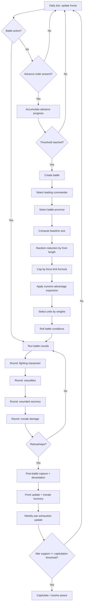

# Victoria 3 Combat Math Deep Dive

## Executive Summary

Victoria 3 warfare is an operational auto-resolver based on:
- Fronts and orders
- Repeating battle creation and battle-round loops
- Province capture and devastation
- Weekly war-support pressure from war exhaustion

The most analyzable portions come from exposed script and define values:
- Battle size logic (front factors + random draws + infrastructure/terrain cap)
- Unit selection weighting (manpower, morale, mobilization, offense/defense)
- Lethality and attrition bounds
- Weekly war exhaustion cadence and auto-capitulation threshold

Some combat internals appear partly hardcoded, so the right approach is constrained estimation with explicit uncertainty.

## Core Abstractions

- `Battalion` / `Flotilla`: commonly treated as up to ~1000 manpower when fully staffed.
- `Front`: carries total battalion pools and front length effects.
- `Province/State`: provides infrastructure and combat-width multiplier.
- `Combat Unit`: manpower, morale, mobilization, offense, defense determine participation weight.

Always separate:
1. Strategic totals on the front
2. Effective engaged force in the specific battle instance

## Battle Generation and Width

### Battle Start Frame

At least one side must advance; progress accumulates; a battle instance spawns when threshold is reached.

### Battle Size Sequence (high-level)

1. Start from front battalion totals
2. Subtract random amount tied to front length
3. Cap by force limit from infrastructure and province combat width
4. Apply numeric-advantage expansion (stochastic)

### Force Limit Formula

```
ForceLimit = ceil((5 + StateInfrastructure / 2) * ProvinceCombatWidthMultiplier)
```

Interpretation:
- This is engagement width capacity for the battle province
- It is not total battalions on the front

### Terrain / Combat Width Multiplier

Common baseline multipliers (version-dependent, patch/mod sensitive):

| Terrain category | Multiplier |
|---|---:|
| Plains | 1.0 |
| Farmland-like / Arctic | 0.8 |
| Desert / Tundra | 0.7 |
| Forestry-like artificial terrain | 0.6 |
| Savanna / Mining-like | 0.5 |
| Woodlands / Hills / Jungle / Wetlands / Docks-like | 0.4 |
| Mountains / Urban-like | 0.3 |

Treat exact coefficients as tunable data, not universal constants.

## Unit Selection into Battle

Eligibility gates:
- Exclude if `manpower < 100`
- Exclude if `morale < 0.20`

Useful analytical approximation:

```
SelectionWeight =
  -1 if ineligible
  manpower * morale * mobilization * relevant_stat otherwise
```

Where:
- `relevant_stat = offense` for attackers
- `relevant_stat = defense` for defenders
- Commander affinity can add strong selection bias

Implication:
- A high nominal front can still field weak battle participants if morale/manpower are degraded.

## Combat Round Loop

Battle rounds follow a repeated sequence:
1. Determine fighting-capable manpower
2. Inflict casualties
3. Recover part of wounded
4. Apply morale damage from casualties
5. Check wipe/retreat end condition

## Lethality, Casualties, Morale, Retreat

Key defines frequently referenced:
- `BATTLE_LETHALITY_MIN = 0.001`
- `BATTLE_LETHALITY_MAX = 0.005`
- `MIN_MANPOWER_CASUALTY_PER_ROUND = 5`

Casualty construction is commonly interpreted as a weighted blend of:
- Raw manpower term
- Combat-efficiency term (offense/defense quality effects)

With representative weighting knobs:
- Raw-manpower ratio weight
- CE ratio weight

Morale:
- Daily recovery baseline often modeled from define values (for non-battle recovery context)
- Casualties drive morale loss in battle
- Supply quality strongly affects sustained readiness

Retreat/escape:
- Modeled as progress accumulation across rounds, not pure binary cutoff
- Includes randomness in accumulation behavior

## Randomness Inventory

Randomness enters at multiple layers:
- Battle condition selection
- Condition rerolls over longer battles
- Battle size subtraction and numeric-advantage expansion
- Weighted unit pulls
- Lethality realization within bounds
- Province selection among high-scoring candidates

## Supply, Navy, Convoys, Attrition

Naval power influences land outcomes mainly through logistics:
- Shipping lanes and convoy capacity
- Convoy raiding and interception
- Supply effectiveness for overseas fronts
- Naval invasion battle creation pathways

Attrition is usually bounded by weekly min/max define values.
Analytical takeaway:
- Supply disruption -> morale/recovery pressure -> lower eligible/effective participants -> weaker battle performance

## War Outcomes: Capture, Devastation, War Support

Post-battle outputs:
- Province capture (scaled by battle outcomes and context)
- Devastation accumulation (economic externality)

War support pressure:
- Evaluated on a weekly cadence (`DAYS_BETWEEN_WAR_EXHAUSTION = 7`)
- Driven by casualty share vs total manpower, battle-loss share, turmoil, and related multipliers
- Auto-capitulation threshold: `AUTO_CAPITULATE_WAR_SUPPORT = -100`

Interpretation:
- Tactical losses convert into strategic collapse through repeated weekly exhaustion updates.

## Worked Width Example

Given:
- Infrastructure = 20
- Combat width multiplier = 0.8

Then:

```
ForceLimit = ceil((5 + 20/2) * 0.8)
           = ceil(15 * 0.8)
           = 12
```

At ~1000 manpower per battalion (full staffing), 12 engaged battalions imply ~12,000 engaged manpower at cap before additional advantage expansion effects.

## Reproducible Analysis Flow



## Comparative Lens

Why it can feel Lanchester-like:
- Repeated attritional rounds
- Engagement-size constraints
- Multiplicative interaction between numbers and efficiency

Why it is not pure Lanchester:
- Terrain width caps
- Probabilistic unit selection
- Morale and recovery dynamics
- Supply/convoy constraints
- Commander and battle-condition effects

## Practical Modeling Guidance

When producing estimates:
1. Treat width and eligibility as first-order filters.
2. Use bounded ranges, not single-point certainty, for per-round losses.
3. Separate nominal force from effective engaged force.
4. Surface unknown hardcoded internals explicitly.
5. Show how logistics and weekly exhaustion transform tactical trends into war-end conditions.
